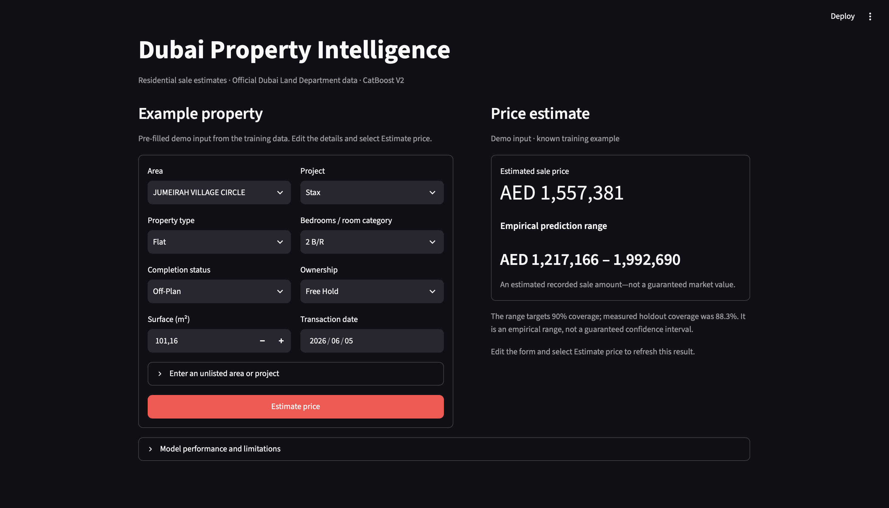
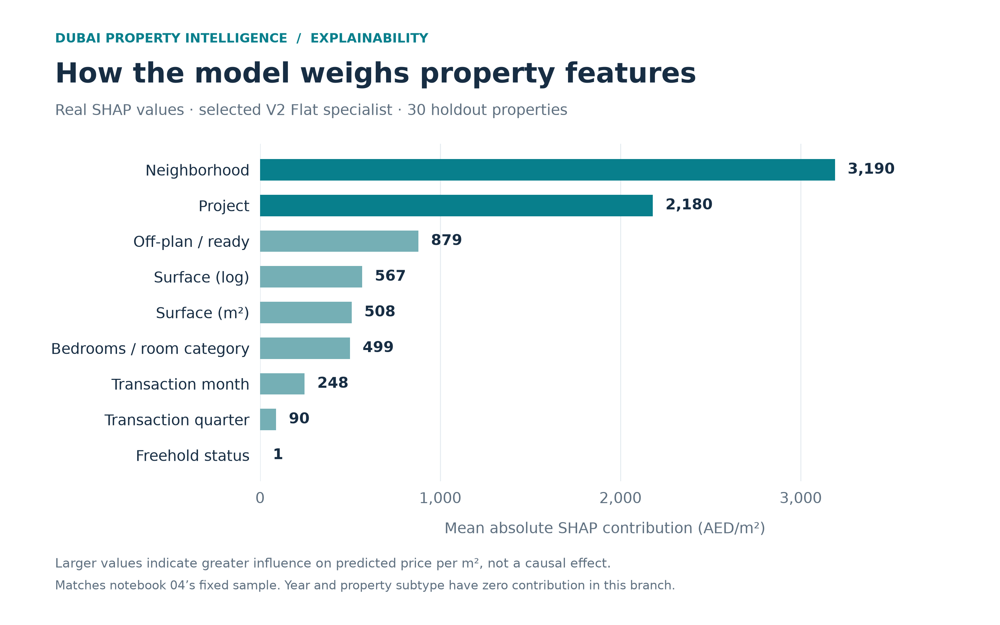
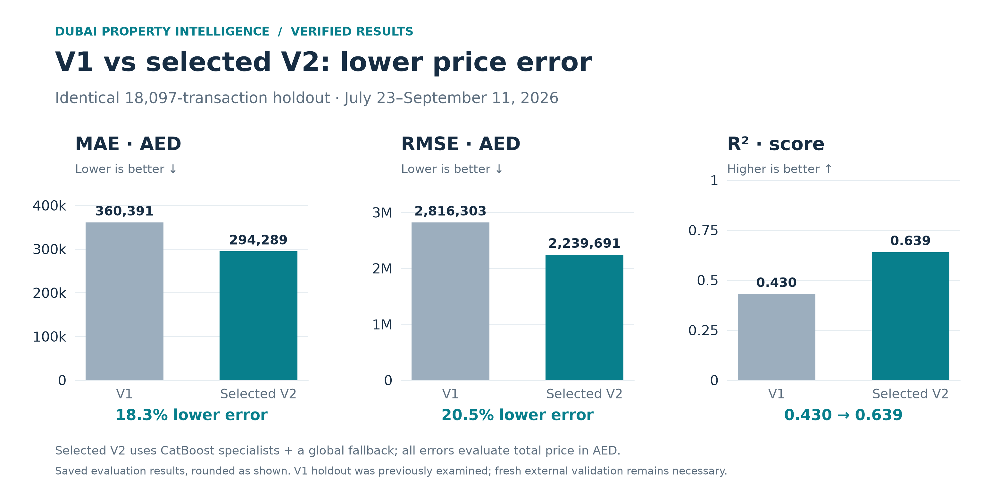

# Dubai Property Intelligence

**An end-to-end machine learning application that estimates Dubai residential sale prices from official transaction data.**

`Python` · `pandas` · `scikit-learn` · `CatBoost` · `SHAP` · `Streamlit` · `pytest`

**Selected V2: MAE AED 294,289 · RMSE AED 2.24M · R² 0.639**  
**18.3% lower MAE than V1 · 63 automated tests passing**

[Results](#key-results) · [Architecture](#visual-architecture) · [Explainability](#explainability) · [Run locally](#reproduction) · [Full technical report](reports/V2_REPORT.md)



## Key results

Measured on the **same 18,097 later transactions**, July 23–September 11, 2026. All errors are in total AED, including predictions reconstructed from price per square metre.

| Metric | V1 | Selected V2 | Change |
|---|---:|---:|---:|
| MAE ↓ | AED 360,391 | **AED 294,289** | **18.3% lower** |
| RMSE ↓ | AED 2,816,303 | **AED 2,239,691** | **20.5% lower** |
| R² ↑ | 0.430 | **0.639** | **+0.209 points** |

Selection used earlier validation data. V2 prioritizes price error rather than R² alone: global CatBoost reached R² 0.661, but the selected specialist architecture achieved lower MAE. The previously examined V1 holdout supports this comparison; a newer export is still needed for independent external validation.

[Full model comparison](reports/V2_REPORT.md) · [Metrics JSON](reports/evaluation.json) · [Verification results](reports/verification.json)

## Project highlights

- **Real data:** official [Dubai Land Department](https://dubailand.gov.ae/en/open-data/real-estate-data/) export; **101,001 residential entries** explored and 97,987 retained after documented quality checks.
- **Realistic evaluation:** chronological training, validation, calibration and final comparison; no final-test model selection.
- **Modeling beyond a benchmark:** five model families, three target formulations and native CatBoost categorical handling; the selected target is **price per square metre**.
- **Specialist + fallback architecture:** Flat and Villa models with a global residential fallback, selected using a predefined validation rule.
- **Explainable estimates:** SHAP, feature importance and empirical uncertainty intervals in a **Streamlit application ready to run locally**.
- **Engineering discipline:** shared training/inference transformations, explicit schema checks, reproducible artifacts and **63 automated tests**.

## Visual architecture

**DLD export → audited residential cohort → chronological experiments → CatBoost specialists + global fallback → calibrated ranges → Streamlit**

> **Architecture diagram — image pending**  
> Save the project pipeline diagram as `docs/pipeline-overview.png`.

<!-- Image pending: add the real diagram, then uncomment the line below. -->
<!--  -->

The application loads the **same serialized preprocessing, target reconstruction and routing used during evaluation**. No separate feature transformations are maintained in the UI.

## Explainability

Surface, area and project are the strongest permutation-importance drivers in the evaluated sample. Notebook 04 combines full-pipeline feature importance, local sensitivity and SHAP to inspect individual predictions. SHAP contributions for the selected model are in **AED/m²**, not total AED, and describe associations rather than causal effects.



*Real SHAP values for notebook 04’s fixed sample of 30 holdout Flats; this explains the Flat specialist, not the entire routed model.*

[Explore the explainability notebook](notebooks/04_explainability.ipynb)

### Model comparison



*Saved evaluation results, rounded as shown. Lower MAE/RMSE and higher R² are better.*

## What I learned

- Defining what one transaction represents matters as much as choosing an algorithm.
- Changing the target formulation can improve predictions without leaking the answer into the features.
- A validation gain may fail on later data: the Villa specialist is a concrete example.
- Useful ML applications need input validation, reproducibility and honest uncertainty—not only strong aggregate metrics.

## Technical details

### Methodology

<details>
<summary>Models, target formulations and leakage prevention</summary>

The task is supervised regression on `TRANS_VALUE`, a recorded sale amount. Five families were benchmarked: median DummyRegressor, Ridge, Random Forest, histogram gradient boosting and CatBoost. XGBoost/LightGBM were not installed in the recorded run.

| Formulation | Internal target | Prediction evaluated in AED |
|---|---|---|
| Direct price | `TRANS_VALUE` | Model output |
| Log price | `log1p(TRANS_VALUE)` | `expm1(output)` |
| Unit price | `TRANS_VALUE / ACTUAL_AREA` | Output × actual surface |

The unit-price target is constructed **inside fitting**, with the outcome kept separate from predictors. `TRANS_VALUE`, `PRICE_PER_SQM`, diagnostic ratios, transaction IDs and unknown columns are rejected as inputs. All formulations use the same predetermined AED 1 floor for nonpositive regression outputs.

Inputs include surface, date, area, subtype, room category, completion status, tenure and project. Derived predictors include log surface, year, month and quarter. Encoders/scalers are fitted within training folds; CatBoost uses native categorical processing on date-ordered training data (`has_time=True`). No external target encoding is used. Registration procedure is excluded because its availability to an ordinary pre-sale app user is not assured.

[Feature and leakage audit](reports/V2_AUDIT.md) · [Modeling notebook](notebooks/03_modeling.ipynb)

</details>

### Preprocessing

<details>
<summary>Data source, scope and documented exclusions</summary>

The original export has 113,866 rows and 22 columns. The residential cohort uses Flat, Villa, Residential / Villas, Residential Flats and Residential / Attached Villas, with Residential usage and Sales group.

| Sequential rule | Rows removed |
|---|---:|
| Outside the residential sale cohort | 12,865 |
| Outside the conservative sale-procedure allowlist | 2,745 |
| Invalid date, price or surface | 0 |
| Known procedure/actual area ratio outside [0.5, 2] | 249 |
| Commercial room label on a residential subtype | 1 |
| Conflicting transaction IDs | 0 |
| Repeated consistent transaction IDs | 19 |

**97,987 entries remain.** The allowlist retains Sale, Sell - Pre registration, Delayed Sell and Sale On Payment Plan. These are transparent modeling assumptions, not an official classification of individual-property sales. Missing procedure area is allowed; suspicious unit prices are flagged for review, not removed. No IQR trimming or luxury-price cap is applied.

Identifiers, constants, mostly missing master project and ambiguous parking-bay labels are excluded from predictors. The raw CSV remains unchanged, with its checksum recorded in [raw_fingerprint.json](reports/raw_fingerprint.json).

[EDA notebook](notebooks/01_data_exploration.ipynb) · [Cleaning notebook](notebooks/02_data_cleaning.ipynb) · [Detailed rules](reports/V2_AUDIT.md)

</details>

### Validation

<details>
<summary>Chronological splits, tuning and specialist selection</summary>

| Partition | Dates in 2026 | Rows | Purpose |
|---|---|---:|---|
| Training | January 1–June 11 | 65,204 | Benchmarks and expanding CV |
| Validation | June 12–July 8 | 9,464 | Model and routing selection |
| Calibration | July 9–22 | 5,222 | Empirical interval calibration |
| Final comparison | July 23–September 11 | 18,097 | Frozen evaluation |

CatBoost and histogram boosting each received three randomized configurations over two expanding training-period folds. Selection prioritizes validation MAE, then RMSE for ties. The selected CatBoost configuration uses 650 trees, depth 8, learning rate 0.04, L2 regularization 10 and MAE loss on unit price. Its small validation MAE gain over untuned CatBoost comes with worse RMSE; the reports preserve that tradeoff.

Specialists and the combined route must improve validation MAE by at least 2%, with no more than 10% RMSE deterioration. Every segment uses identical date boundaries. Final estimators fit through July 8 and are **not refitted after calibration**. V1 fitted through July 22, so V2 reserves more data for uncertainty estimation.

The paired day-bootstrap interval for V1-to-V2 MAE reduction is approximately AED 48,584–85,732. Date dependence and prior inspection of this holdout limit external claims.

[Complete experiments and subgroup results](reports/V2_REPORT.md)

</details>

### Model architecture and robustness

<details>
<summary>Code organization, inference parity and automated checks</summary>

| Component | Responsibility |
|---|---|
| `src/config.py` | Shared paths, dates and feature contract |
| `src/schema.py` | Input/target validation and leakage checks |
| `src/preprocessing.py`, `src/audit.py` | Cohort creation and review diagnostics |
| `src/features.py` | Shared feature engineering and fitted encoders |
| `src/estimators.py` | Target reconstruction, CatBoost adapter and routing |
| `src/benchmark.py`, `src/model.py` | Benchmarks, tuning, selection and persistence |
| `src/evaluation.py` | Splits, metrics, intervals and error analysis |
| `src/inference.py`, `app/streamlit_app.py` | Validated artifact loading and application |
| `tests/test_pipeline.py` | 63 automated behavioral checks |

`models/price_pipeline.joblib` contains the evaluated prediction path. Its `.metadata.json` sidecar records configuration, features, dates, versions, calibration, metrics and a checksum. Load only trusted joblib files; checksums detect accidental mismatches, not malicious artifacts.

Validation rejects missing required columns, duplicate/extra columns, malformed dates, invalid closed-domain categories and nonfinite/nonpositive surface or targets. Surface has a generous 1,000,000 m² sanity bound. Missing optional categories become Unknown; unseen area/project names are supported; feature order is canonicalized.

The app catches invalid inputs and artifact failures, flags extrapolation and refreshes cached artifacts after retraining. Tests cover schema, leakage, date splits, target reconstruction, reproducibility, unseen categories, persistence and the app-facing service. Compile/import, V2 notebook execution, SHAP reconstruction and Streamlit smoke checks passed; every saved holdout prediction was reproduced. Ruff/Black were unavailable and were not installed solely for formatting.

[Verification record](reports/verification.json)

</details>

### Limitations and next steps

- **Specialization is not uniformly better.** Flat-only holdout MAE improves 5.3% versus global V2; Villa-only MAE worsens 5.2%, despite its validation gain. Routing was not changed after inspecting final results.
- **Uncertainty is empirical.** Nominal 90% ranges achieved 88.3% overall coverage, but only 40.9% for observed prices above AED 10M. They are not guaranteed confidence intervals.
- **Scope remains imperfect.** Rare Residential Flats have roughly AED 22M MAE across only 12 holdout entries. Bulk/partial-interest transactions may remain; floor, view, condition and stable unit IDs are unavailable.
- **External validation is still needed.** Obtain a newer export, review transaction semantics, revisit Villa routing on fresh periods and monitor subgroup errors and interval coverage. These estimates do not replace professional valuations.

## Reproduction

Python 3.11 is tested. Place the official export at `data/raw/transactions-2026-09-11.csv`; raw data and trained artifacts are excluded from git.

```bash
python3 -m venv .venv
source .venv/bin/activate
pip install -r requirements-lock.txt

python -m src.preprocessing
python -m src.audit
python -m src.model
streamlit run app/streamlit_app.py
```

If the local model already exists, activate the environment and run the final command. This repository provides a Streamlit app; no hosted deployment is claimed.

<details>
<summary>Tests, notebooks, custom paths and V1 archives</summary>

```bash
python -m pytest -q
python -m compileall -q src app tests
jupyter lab

jupyter nbconvert --to notebook --execute --inplace --ExecutePreprocessor.timeout=600 notebooks/02_data_cleaning.ipynb notebooks/03_modeling.ipynb notebooks/04_explainability.ipynb
```

Notebook 03 reads frozen experiment reports; it does not silently retrain. Notebook 04 computes feature importance and SHAP in the appropriate target units. SHAP is included in the recorded lock; with `requirements.txt` instead, install it separately using `pip install shap`.

```bash
python -m src.preprocessing --input data/raw/my_export.csv --output data/processed/my_sales.csv
python -m src.model --input data/processed/my_sales.csv --artifact models/my_model.joblib --reports reports/my_run
```

For another historical window, set the central dates in `src/config.py`; all four partitions must be nonempty. The app loads the configured default artifact, and the audit uses the configured raw extract. Fixed seeds, bounded threads and recorded versions support reproducibility; cross-platform numerical differences remain possible.

V1 reports are preserved under `reports/v1/`. Local V1 artifacts under `models/v1/` require their original `source.zip` code in an isolated environment, rather than the V2 feature classes. Source access and reuse remain subject to DLD's applicable conditions; data is not downloaded automatically.

</details>

## Portfolio visuals

The SHAP and comparison charts above were exported from the saved model and evaluation results; they contain no invented values.

| File | Status / source |
|---|---|
| `docs/shap-summary.png` | Created from notebook 04’s actual CatBoost SHAP analysis; Flat specialist, AED/m² |
| `docs/model-comparison.png` | Created from the saved V1 and selected V2 evaluations on the same holdout |
| `docs/app-preview.png` | Available: real Streamlit inputs, estimate and empirical range |
| `docs/pipeline-overview.png` | Pending: create the architecture diagram separately |

For each pending image, save the real asset at the path above, uncomment its image reference and remove the corresponding pending notice.
